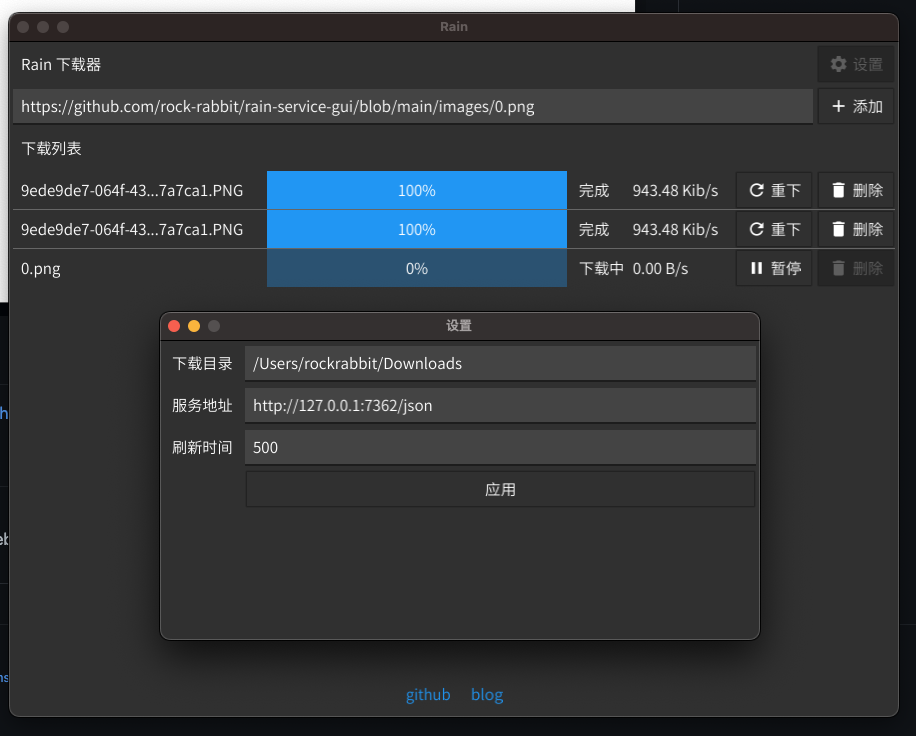

## rain-service-gui - 下载服务的图形界面

文件下载器，基于 fyne 的图形化界面。

## 特点

* 文件下载
* 跨平台

## 演示

## 感谢

* ttc 思源黑体提供者 - https://github.com/be5invis/source-han-sans-ttf

## 体验

我之前使用过 PyQT、C#、Electron 写过图形界面，第一次尝试使用 GO 原生的图形库，写的感觉上和 C# 差不多，总体来说很痛苦，没有 Web 界面写起来得心应手。